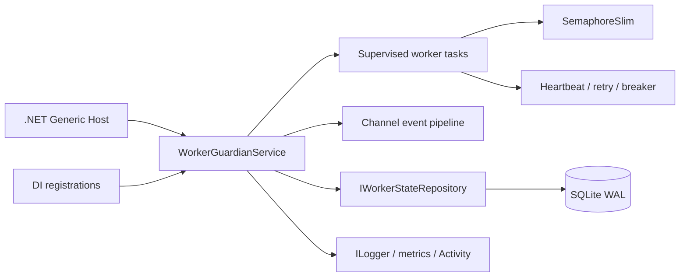

# worker-guardian-dotnet

[](https://github.com/NAOKI-Ko/worker-guardian-dotnet/actions/workflows/ci.yml)


[](LICENSE)

`worker-guardian-dotnet` is a resilience and supervision framework for .NET workers and background
services. It adds explicit lifecycle state, health and heartbeat monitoring, bounded restarts,
durable snapshots, typed events, and observability without requiring ASP.NET.

## Why this exists

Production workers need more than `Task.Run`: they must stop cooperatively, report liveness,
recover from transient failures, protect dependencies, and expose useful state. This library makes
those concerns reusable through .NET hosting, options, dependency injection, and narrow interfaces.

## Features

- hosted worker registration through the standard dependency-injection container
- immutable records and an explicit lifecycle state machine
- cooperative cancellation, graceful shutdown, heartbeat timeouts, and aggregate health probes
- bounded exponential restart policy with jitter and a reusable circuit breaker
- `Channel<T>` event pipeline with backpressure for started, stopped, failed, restarted, unhealthy,
  and recovered events
- `SemaphoreSlim` execution bounds and parallel health aggregation with `Parallel.ForEachAsync`
- replaceable state repository with a WAL-enabled asynchronous SQLite implementation
- structured `ILogger` messages, metrics abstraction, execution timing, and `ActivitySource` spans
- nullable reference types, C# analyzers, central package management, and locked dependencies

## Architecture



See [docs/architecture.md](docs/architecture.md) for responsibilities, data flow, concurrency,
errors, extension points, and trade-offs.

## Installation

.NET 10 SDK is required. From a source checkout:

```bash
dotnet restore WorkerGuardian.slnx --locked-mode
dotnet build WorkerGuardian.slnx -c Release --no-restore
```

The packable library project is `src/WorkerGuardian/WorkerGuardian.csproj`.

## Quick start

```csharp
using Microsoft.Extensions.DependencyInjection;
using Microsoft.Extensions.Hosting;
using WorkerGuardian;

var builder = Host.CreateApplicationBuilder(args);
builder.Services
    .AddWorkerGuardian(options => options.DatabasePath = "guardian.db")
    .AddGuardianWorker<QueueConsumer>(new WorkerId("queue-consumer"));

await builder.Build().RunAsync();

sealed class QueueConsumer : IGuardianWorker
{
    public async ValueTask ExecuteAsync(
        WorkerExecutionContext context,
        CancellationToken cancellationToken)
    {
        while (!cancellationToken.IsCancellationRequested)
        {
            context.Heartbeat();
            await Task.Delay(TimeSpan.FromSeconds(1), cancellationToken);
        }
    }

    public ValueTask<WorkerHealth> CheckHealthAsync(CancellationToken cancellationToken) =>
        ValueTask.FromResult(new WorkerHealth(WorkerHealthStatus.Healthy));
}
```

## Examples

The example application exposes three executable scenarios:

```bash
dotnet run --project examples/WorkerGuardian.Examples -- basic
dotnet run --project examples/WorkerGuardian.Examples -- retry
dotnet run --project examples/WorkerGuardian.Examples -- concurrency
```

They demonstrate normal lifecycle transitions, an injected transient failure followed by recovery,
and six workers constrained to two concurrent executions.

## Design decisions

- Snapshots are immutable records; every legal state change creates a new persisted value.
- Workers receive only an execution context and cancellation token, keeping the public contract small.
- The bounded channel waits instead of dropping lifecycle events silently.
- SQLite is an operational default, while `IWorkerStateRepository` keeps persistence replaceable.
- User exceptions become typed failure events; host cancellation remains a distinct control path.
- Health probes run in parallel because they should not serialize unrelated dependencies.

## Testing

```bash
dotnet restore WorkerGuardian.slnx --locked-mode
dotnet build WorkerGuardian.slnx -c Release --no-restore
dotnet run --project tests/WorkerGuardian.Tests -c Release --no-build -- \
  --minimum-expected-tests 20
dotnet format WorkerGuardian.slnx --verify-no-changes --no-restore
```

The xUnit suite covers unit, SQLite integration, hosted-service integration, concurrency bounds,
heartbeat failure, restart/recovery, cancellation, edge cases, and FsCheck-generated backoff inputs.
Microsoft Testing Platform collects line and branch coverage; CI rejects either value below 90%.

## Benchmark

BenchmarkDotNet measures restart-policy calculation and concurrent metrics recording. Results depend
on the host and are intentionally not claimed here.

```bash
dotnet run --project benchmarks/WorkerGuardian.Benchmarks -c Release
```

## Roadmap

- distributed worker ownership and coordination
- first-party OpenTelemetry exporter and semantic conventions
- PostgreSQL state repository with transactional leases
- durable event replay and configurable retention

## Contributing

Read [CONTRIBUTING.md](CONTRIBUTING.md) before opening a pull request. Report security issues using
the private process in [SECURITY.md](SECURITY.md).

## License

MIT. See [LICENSE](LICENSE).
