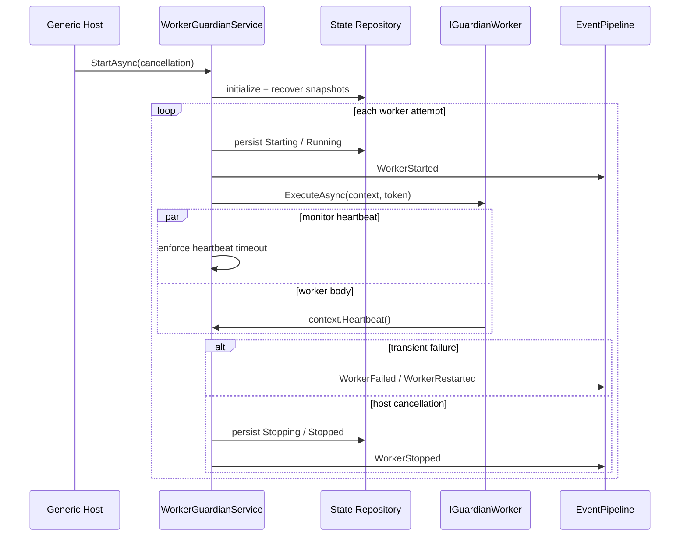

# Architecture

## System overview

The framework joins .NET's Generic Host as one `BackgroundService`. It constructs each registered
worker through dependency injection, persists an initial snapshot, and runs an independent
supervision loop per registration. Those loops share a concurrency semaphore and event channel.

## Component responsibilities

- `WorkerGuardianService` owns supervision tasks, lifecycle transitions, shutdown, monitoring, and
  aggregate health.
- `IGuardianWorker` is the user extension point for execution and health probes.
- `WorkerSnapshot` is the immutable state model and enforces legal transitions.
- `RestartPolicy` validates and calculates bounded exponential backoff with jitter.
- `CircuitBreaker` protects repeated attempts and models closed, open, and half-open states.
- `EventPipeline<TEvent>` provides bounded asynchronous delivery through `Channel<T>`.
- `IWorkerStateRepository` isolates storage; `SqliteWorkerStateRepository` supplies local durability.
- `IGuardianMetrics`, `ILogger`, and `ActivitySource` expose measurements without binding a vendor.

## Data flow

Registrations enter through DI. On host start, durable snapshots are read to annotate recovery and a
fresh registered snapshot is saved. Every lifecycle boundary replaces and persists a snapshot before
the corresponding event is published. Workers emit heartbeat timestamps through their context.
Health probes return typed values and are aggregated into healthy, degraded, or unhealthy status.

## Concurrency model

Each registration has one asynchronous supervision loop. `Task.WhenAll` gives the host one lifetime
for all loops, while `SemaphoreSlim` bounds worker bodies that may compete for scarce resources.
`ExecuteMonitoredAsync` races execution with periodic heartbeat checks using linked cancellation.
`Parallel.ForEachAsync` probes health without serial head-of-line blocking. Shutdown flows through
the host token, then persists `Stopping` and `Stopped` using an uncancelled cleanup path.

The channel is multi-writer and multi-reader with wait-mode backpressure. The SQLite adapter opens a
short-lived asynchronous connection per operation and enables WAL so readers do not block durable
writes unnecessarily.

## Error model

Invalid identifiers, options, policies, and lifecycle transitions fail immediately. Worker failures
are reduced to immutable `FailureInfo`, published, and retried within policy bounds. Heartbeat expiry
uses the same retry path after first emitting `WorkerUnhealthy`. A circuit-open failure prevents an
attempt from reaching user code. Exhausted workers end in `Failed`; host cancellation is handled as
normal shutdown and is not counted as a resilience failure.

## Extension points

- implement `IGuardianWorker` for queue consumers, pollers, schedulers, and maintenance loops;
- implement `IWorkerStateRepository` for PostgreSQL, Redis, or distributed leases;
- implement `IGuardianMetrics` for OpenTelemetry, Prometheus, or another monitoring backend;
- consume `IWorkerGuardian.Events` to bridge typed events into a durable stream;
- replace `TimeProvider` in tests or deterministic simulations.

## Trade-offs

A single hosted service keeps state ownership clear but does not coordinate multiple processes. The
built-in event channel is intentionally in-memory; durable consumers should bridge it to external
storage. Backpressure preserves event fidelity at the cost of allowing a stalled consumer to delay
publishers. SQLite is practical for one host, not a distributed lock service. Cancellation is
cooperative, so worker implementations must observe their token and avoid uninterruptible calls.
